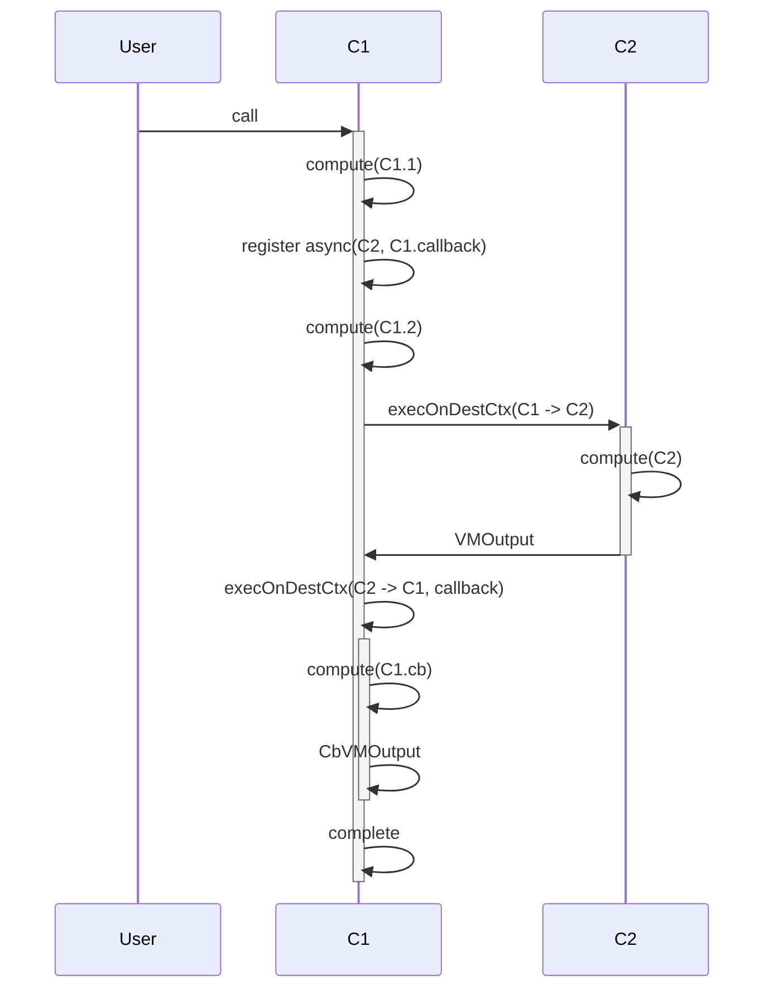
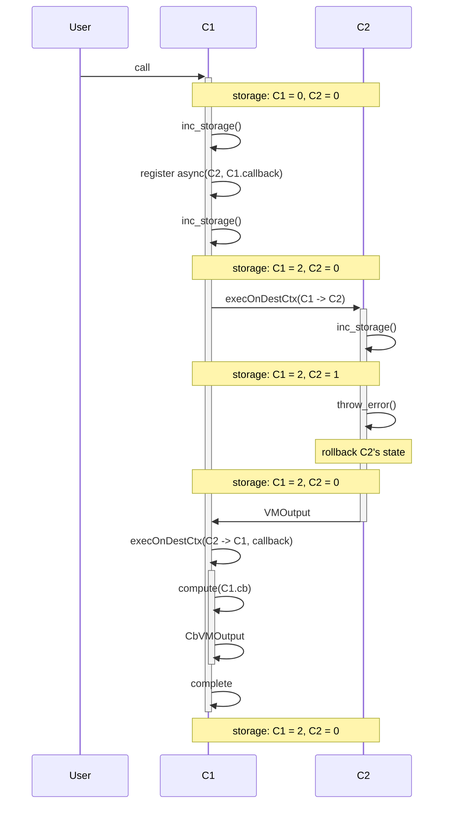
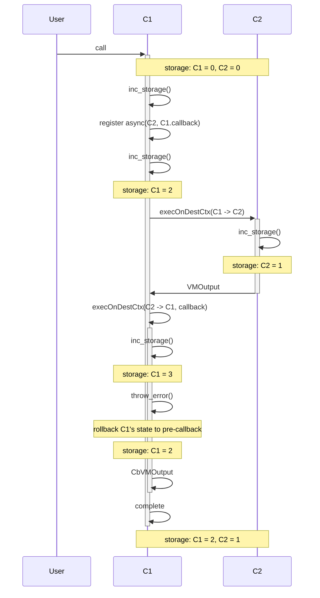

## 1 async call

```rust

shard S1 {
  trait C1 {
    fn endpoint() {
      compute("C1.1")
      async(C2, callback)
      compute("C1.2")
    }

    fn callback() {
      compute("C1.cb")
    }
  }

  trait C2 {
    fn endpoint() {
      compute("C2")
    }
  }
  
}

```




## 1 async call, call fails


```rust

shard S1 {
  trait C1 {
    storage = 0
    fn endpoint() {
      inc_storage()
      async(C2, callback)
      inc_storage()
    }

    fn callback(res) {
      compute("C1.cb")
    }
  }

  trait C2 {
    storage = 0
    fn endpoint() {
      inc_storage()
      throw_error()
    }
  }
  
}

```




## 1 async call, callback fails


```rust

shard S1 {
  trait C1 {
    storage = 0
    fn endpoint() {
      inc_storage()
      async(C2, callback)
      inc_storage()
    }

    fn callback(res) {
      inc_storage()
      throw_error()
    }
  }

  trait C2 {
    storage = 0
    fn endpoint() {
      inc_storage()
    }
  }
  
}

```




