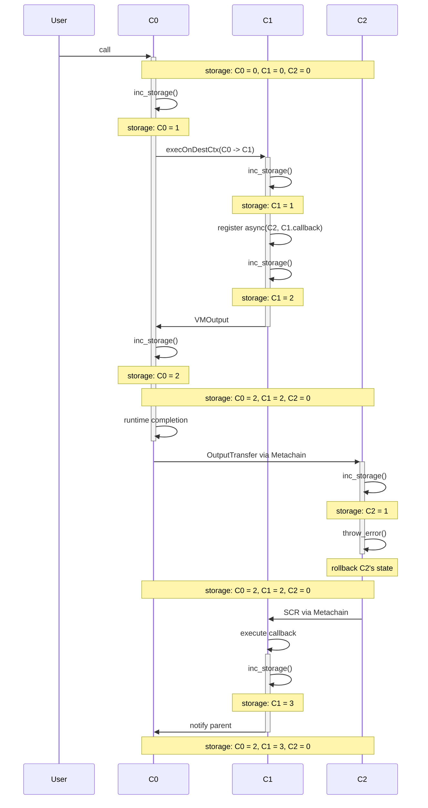
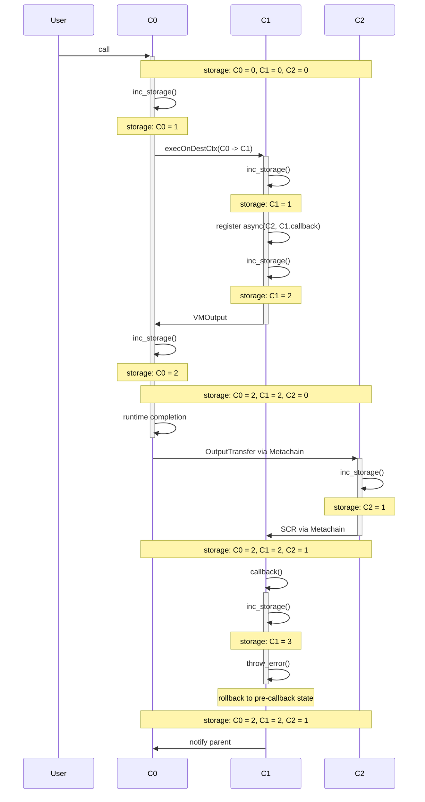
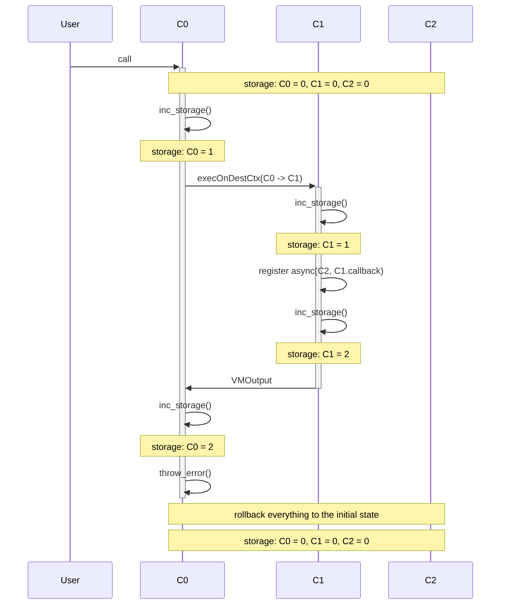

## 1 sync, 1 async call


```rust
shard S1 {

  trait C0 {
    storage = 0
    fn endpoint() {
      inc_storage()
      sync(C1)
      inc_storage()
    }
  }

  trait C1 {
    storage = 0
    fn endpoint() {
      inc_storage()
      async(C2, callback)
      inc_storage()
    }
    fn callback(res) {
      inc_storage()
    }
  }
}

shard S2 {
  trait C2 {
    storage = 0
    fn endpoint() {
      inc_storage()
    }
  }  
}
```

```
User -> C0 -sync-> C1 -> C0.remaining ~~> C2 ~~> C1.callback
```

Final storage after successful eecution:

```
C0 = 2
C1 = 3
C2 = 1
```

The following scenarios examine cases where any of these steps fail.

### The async call fails


```rust
shard S1 {

  trait C0 {
    storage = 0
    fn endpoint() {
      inc_storage()
      sync(C1)
      inc_storage()
    }
  }

  trait C1 {
    storage = 0
    fn endpoint() {
      inc_storage()
      async(C2, callback)
      inc_storage()
    }

    fn callback(res) {
      inc_storage()
    }
  }
}

shard S2 {
  trait C2 {
    storage = 0
    fn endpoint() {
      inc_storage()
      throw_error()
    }
  }
  
}

```




### The callback fails


```rust
shard S1 {

  trait C0 {
    storage = 0
    fn endpoint() {
      inc_storage()
      sync(C1)
      inc_storage()
    }
  }

  trait C1 {
    storage = 0
    fn endpoint() {
      inc_storage()
      async(C2, callback)
      inc_storage()
    }

    fn callback(res) {
      inc_storage()
      throw_error()
    }
  }
}

shard S2 {
  trait C2 {
    storage = 0
    fn endpoint() {
      inc_storage()
    }
  }
  
}

```




### The root call fails after sync call


```rust

shard S1 {

  trait C0 {
    storage = 0
    fn endpoint() {
      inc_storage()
      sync(C1)
      inc_storage()
      throw_error()
    }
  }

  trait C1 {
    storage = 0
    fn endpoint() {
      inc_storage()
      async(C2, callback)
      inc_storage()
    }

    fn callback(res) {
      inc_storage()
    }
  }
}

shard S2 {
  trait C2 {
    storage = 0
    fn endpoint() {
      inc_storage()
    }
  }
  
}

```


