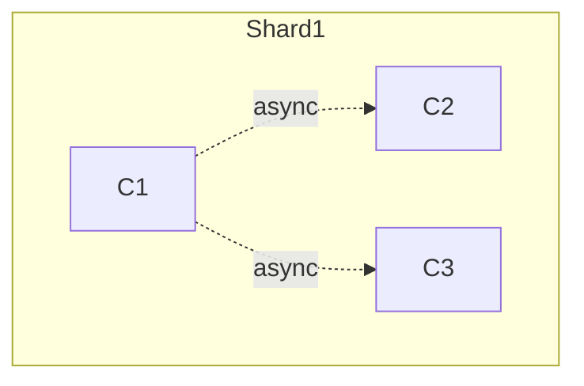
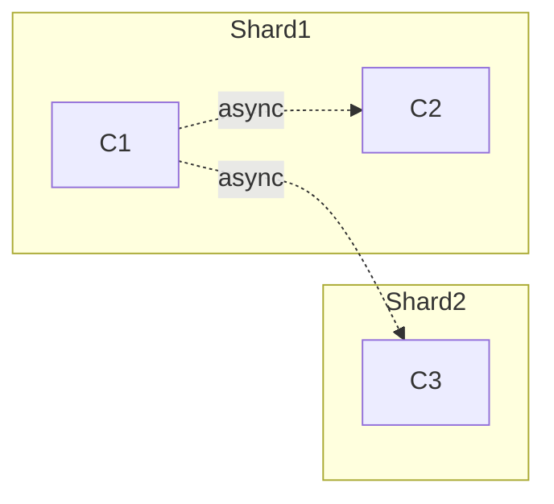
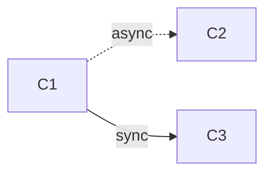
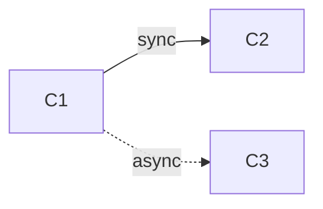
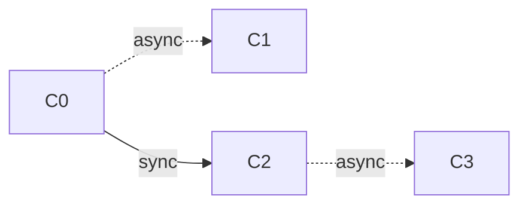
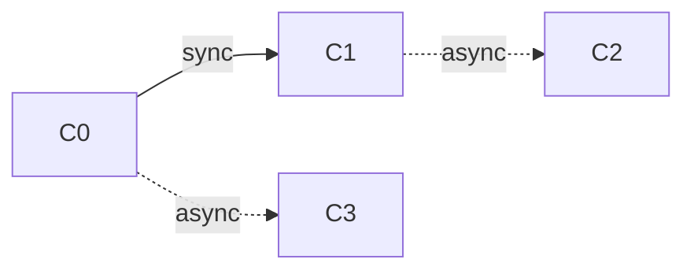

Test cases in this folder aim to cover all possible scenarios with the following limitations:

* The call graph between contracts forms a tree.
* A node in this tree can be one of these:
  * sync internal node: calls 1 or 2 internal nodes synchronously.
  * async internal node: calls 1 or 2 leaf nodes asynchronously. 
    Async calls can only be made to leaf calls since multi-level async calls are not allowed,
    and sync calls behave as normal function calls if they do not involve any async calls. 
  * sync/async internal node: makes 1 sync, 1 async call.
  * leaf node: doesn't make any sync or async calls.
* Maximum tree depth is 2.

## Generating possible cases and naming 

```haskell
data Tree = A Shard Tree
      	  | AA Shard Shard
      	  | S Tree   	 
      	  | SS Tree Tree
      	  | SA Tree Shard
      	  | AS Shard Tree  

data Shard ::= I | C
```

We name these cases using a textual representation where levels on the tree are separated by underscores (`_`), and siblings by hyphens (`-`). Sync nodes are denoted as "s|ss" followed by an underscore and textual representations of their children separated by hyphens. Async nodes are represented as "a|aa," followed by sharding information in parentheses. For instance, [aa(i,i)](aa(i,i).md) represents a case where a contract initiates 2 intra-shard async calls. In this specific case, the call tree has a depth of 1.



[aa(i,c)](aa(i,c).md) is the case where the first contract sends 1 intra and 1 cross shard async call.



The section [SA and SA](#sa-and-as) examines scenarios where synchronous and asynchronous calls are utilized within the same contract, with a depth of 1.

### Examples

All cases without symmetries

1. [a(i)](a(i).md)
2. [a(c)](a(c).md)
3. [aa(i,i)](aa(i,i).md)
4. [aa(i,c)](aa(i,c).md)
5. [aa(c,c)](aa(c,c).md)
6. [s_a(i)](s_a(i).md)
7. [s_a(c)](s_a(c).md)
8. [s_aa(i,i)](s_aa(i,i).md)
9. [s_aa(i,c)](s_aa(i,c).md)
10. [s_aa(c,c)](s_aa(c,c).md)
11. [ss_a(i)-a(i)](ss_a(i)-a(i).md)
12. [ss_a(i)-a(c)](ss_a(i)-a(c).md)
13. [ss_a(c)-a(c)](ss_a(c)-a(c).md)
14. [ss_a(i)-aa(i,i)](ss_a(i)-aa(i,i).md)
15. [ss_a(i)-aa(i,c)](ss_a(i)-aa(i,c).md)
16. [ss_a(i)-aa(c,c)](ss_a(i)-aa(c,c).md)
17. [ss_a(c)-aa(i,i)](ss_a(c)-aa(i,i).md)

The following cases are more complex variants of the above.

1. `ss_a(c)-aa(i,c)`: similar to [ss_a(c)-aa(i,i)](ss_a(c)-aa(i,i).md) and [ss_a(i)-aa(i,c)](ss_a(i)-aa(i,c).md)  
2. `ss_a(c)-aa(c,c)`: similar to [ss_a(c)-a(c)](ss_a(c)-a(c).md) with 3 async calls
3. `ss_aa(i,i)-aa(i,i)`: similar to [ss_a(i)-aa(i,i)](ss_a(i)-aa(i,i).md)
4. `ss_aa(i,i)-aa(i,c)`: similar to [ss_a(i)-aa(i,c)](ss_a(i)-aa(i,c).md)
5. `ss_aa(i,i)-aa(c,c)`: similar to [ss_a(i)-aa(c,c)](ss_a(i)-aa(c,c).md)
6. `ss_aa(i,c)-aa(i,c)`: similar to `ss_a(c)-aa(i,c)`
7. `ss_aa(i,c)-aa(c,c)`: similar to `ss_a(c)-aa(c,c)`
8. `ss_aa(c,c)-aa(c,c)`: similar to `ss_a(c)-aa(c,c)`

### SA and AS

This section examines scenarios where sync and async calls are utilized within the same contract, specifically with a depth of 1. In these cases, we utilize a slightly modified textual encoding. Sharding information in asynchronous calls is not considered, and the symbol 'x' is used to denote leaf nodes where there are no calls.

* `as_x-x`: This case reduces to [a(i)](a(i).md) or [a(c)](a(c).md) depending on sharding.



* `sa_x-x`: This case reduces to [a(i)](a(i).md) or [a(c)](a(c).md).



* [`as_x-a_x`](as_x-a_x.md): Async call and sync call in the same contract



* [`sa_a-x_x`](sa_a-x_x.md): Async call and sync call in the same contract




## Multi-level async calls

The call tree representation above does not cover call trees with multi-level async calls because it is not allowed in Async Calls V2. Such calls are immediately rejected during registration. An example of this case can be found in [a_a_x](a_a_x.md).
