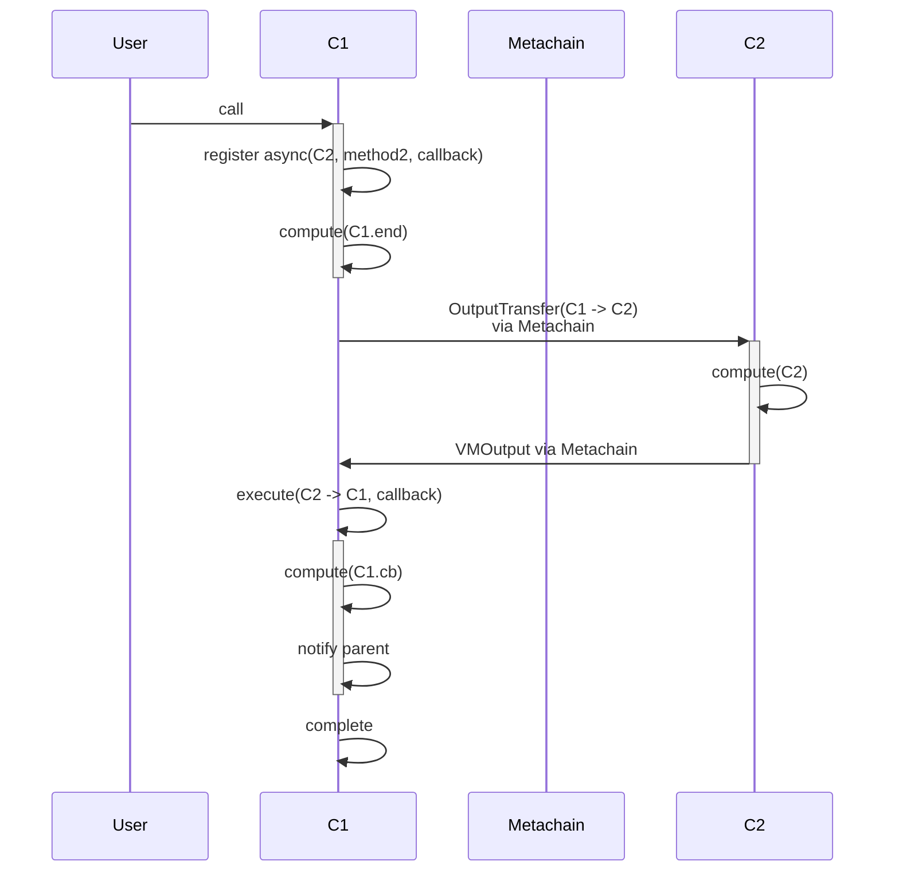
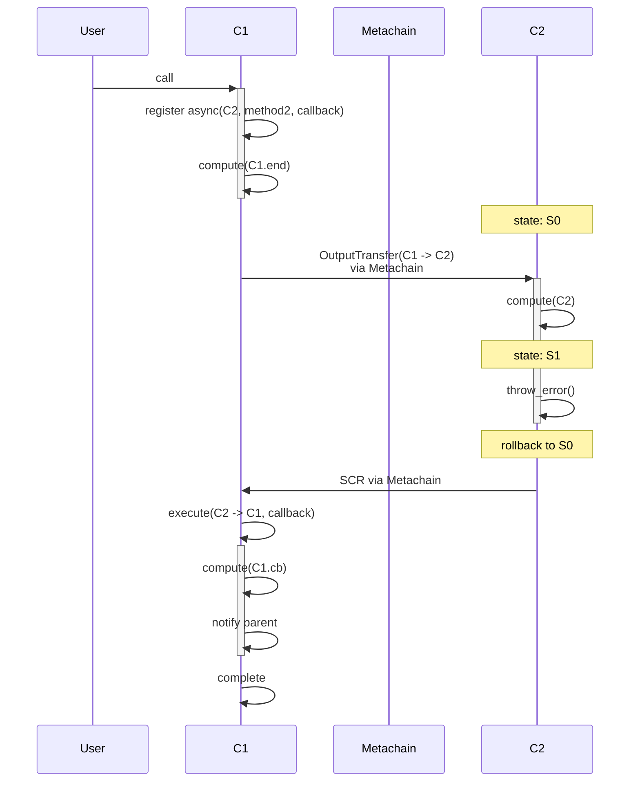
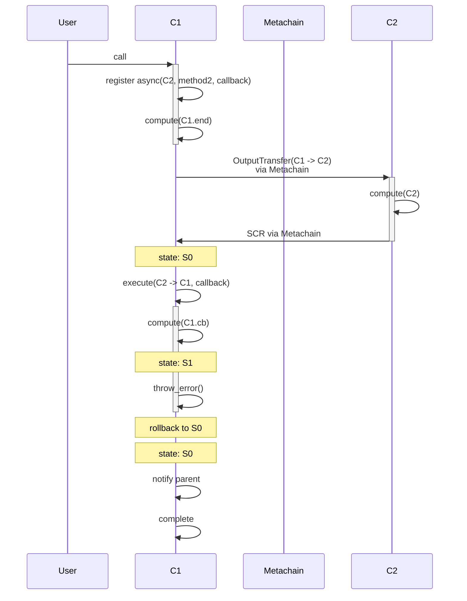

## 1 async call

```rust

shard Sh1 {
  contract C1 {
    fn method1() {
      async(C2, method2, callback)
      compute("C1.end")
    }

    fn callback() {
      compute("C1.cb")
    }
  }
}

shard Sh2 {
  contract C2 {
    fn method2() {
      compute("C2")
    }
  }
  
}

```




## 1 async call, call fails


```rust

shard Sh1 {
  contract C1 {
    fn method1() {
      async(C2, method2, callback)
    }

    fn callback(res) {
      compute("C1.cb")
    }
  }
}

shard Sh2 {
  contract C2 {
    fn method2() {
      compute("C2")
      throw_error()
    }
  }
  
}

```




## 1 async call, callback fails


```rust

shard Sh1 {
  contract C1 {
    fn method1() {
      async(C2, method2, callback)
    }

    fn callback(res) {
      compute("C1.cb")
      throw_error()
    }
  }
}

shard Sh2 {
  contract C2 {
    fn method2() {
      compute("C2")
    }
  }
}

```




