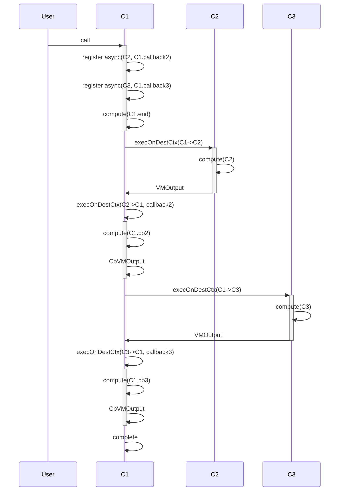

## 2 async call

```rust

shard Sh1 {
  contract C1 {
    fn method1() {
      async(C2, callback2)
      async(C3, callback3)
      compute("C1.end")
    }

    fn callback2() {
      compute("C1.cb2")
    }

    fn callback3() {
      compute("C1.cb3")
    }
  }

  contract C2 {
    fn method2() {
      compute("C2")
    }
  }
  
  contract C3 {
    fn method3() {
      compute("C3")
    }
  }
  
}

```




## Failure cases

Errors in one async call does not affect the other async call. An error in C2 doesn't cancel the async call to C3. Errors in async calls are handled independently as in [a_i.md](a_i.md).