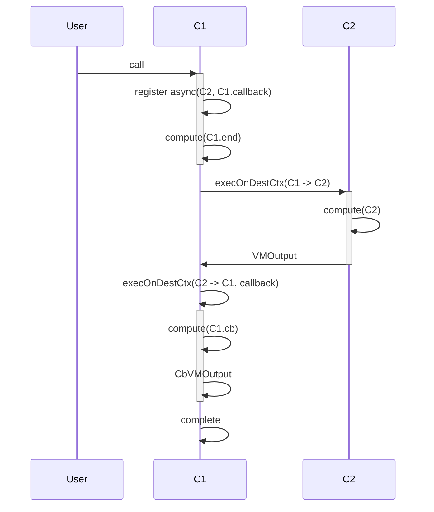
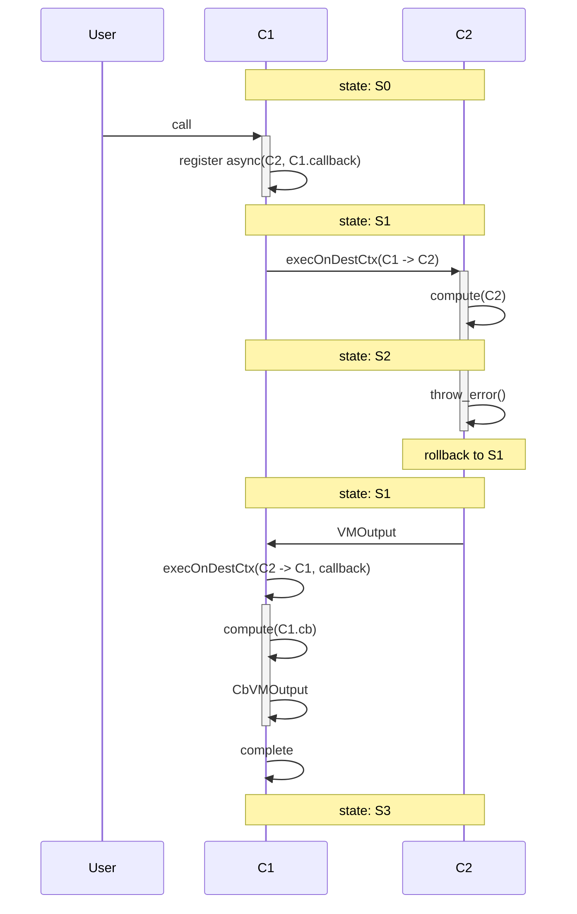
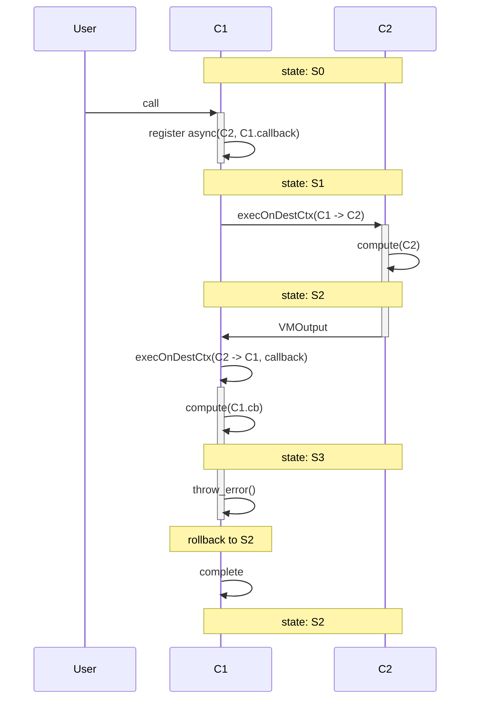

## 1 

Successfull case

```rust

shard Sh1 {
  contract C1 {
    fn method1() {
      async(C2, callback)
      compute("C1.end")
    }

    fn callback() {
      compute("C1.cb")
    }
  }

  contract C2 {
    fn method2() {
      compute("C2")
    }
  }
  
}

```




## 2

The async call fails

```rust

shard Sh1 {
  contract C1 {
    fn endpoint() {
      async(C2, callback)
    }

    fn callback(res) {
      compute("C1.cb")
    }
  }

  contract C2 {
    fn endpoint() {
      compute("C2")
      throw_error()
    }
  }
  
}

```




## 3

The callback fails

```rust

shard Sh1 {
  contract C1 {
    fn endpoint() {
      async(C2, callback)
    }

    fn callback(res) {
      compute("C1.cb")
      throw_error()
    }
  }

  contract C2 {
    fn endpoint() {
      compute("C2")
    }
  }
}
```



## 4

`C1` fails after async registration: the async call is cancelled, everything is reverted.