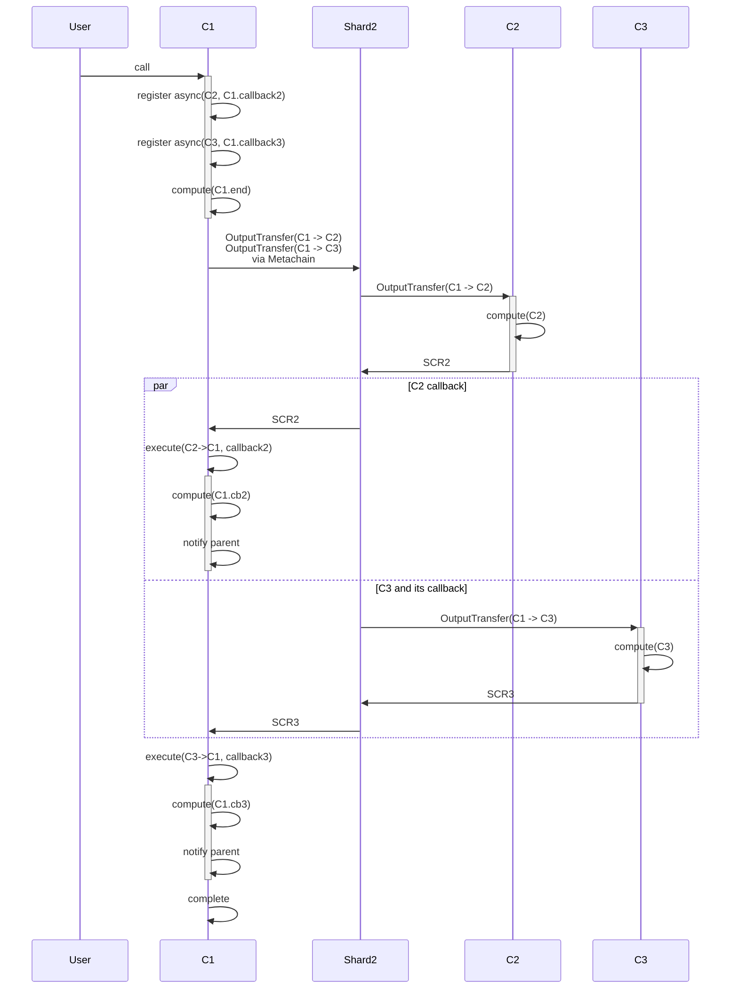
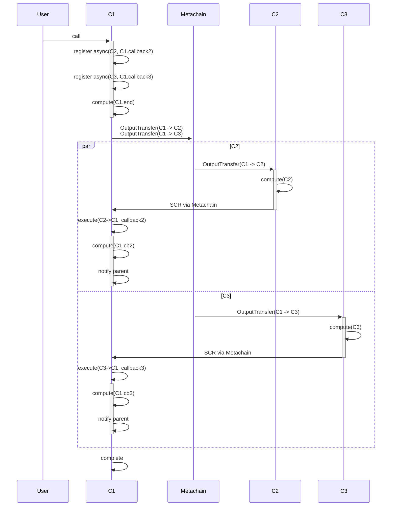

## 2 async call, both cross shard, to same shard

```rust

shard Sh1 {
  contract C1 {
    fn method1() {
      async(C2, callback2)
      async(C3, callback3)
      compute("C1.end")
    }

    fn callback2() {
      compute("C1.cb2")
    }

    fn callback3() {
      compute("C1.cb3")
    }
  }
}

shard Sh2 {
  contract C2 {
    fn method2() {
      compute("C2")
    }
  }

  contract C3 {
    fn method3() {
      compute("C3")
    }
  }
}

```




Execution order between `C2` and `C3` is preserved, i.e., `C2` is guaranteed to run before `C3`. Similarly, `SCR2` (result of `C2`) always arrives at `C1` before `SCR3`, so `callback2` is executed before `callback3`.

## 2 async call, both cross shard, different shards

```rust

shard Sh1 {
  contract C1 {
    fn method1() {
      async(C2, callback2)
      async(C3, callback3)
      compute("C1.end")
    }

    fn callback2() {
      compute("C1.cb2")
    }

    fn callback3() {
      compute("C1.cb3")
    }
  }
}

shard Sh2 {
  contract C2 {
    fn method2() {
      compute("C2")
    }
  }
}

shard Sh3 {
  contract C3 {
    fn method3() {
      compute("C3")
    }
  }
}

```




Async calls to `C2` and `C3` are executed in parallel. Execution order of `callback2` and `callback3` may vary.
