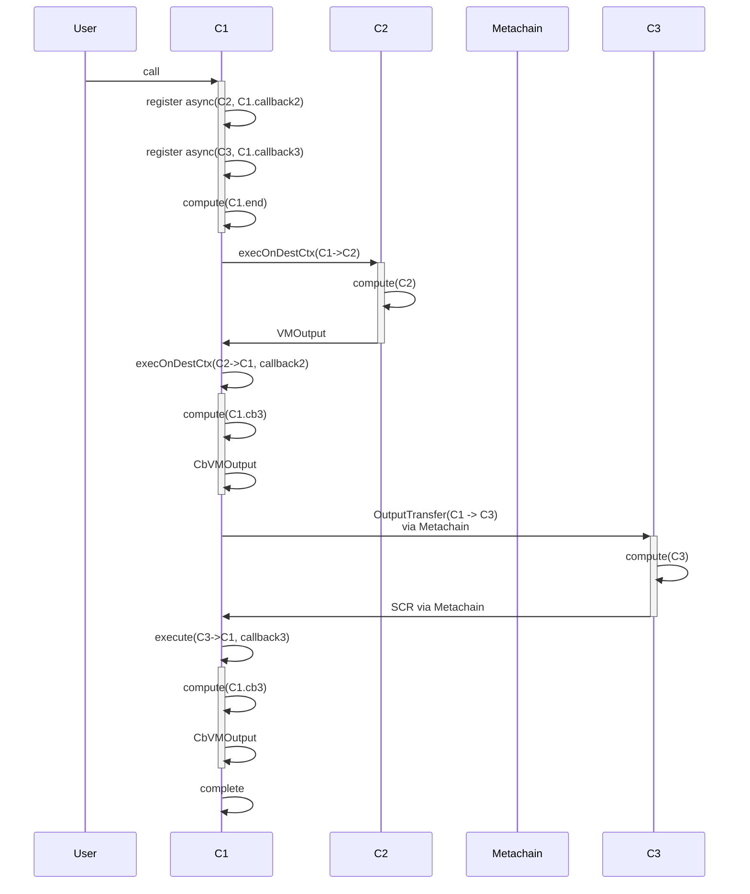

## 2 async call

```rust

shard Sh1 {
  contract C1 {
    fn method1() {
      async(C2, callback2)
      async(C3, callback3)
      compute("C1.end")
    }

    fn callback2() {
      compute("C1.cb2")
    }

    fn callback3() {
      compute("C1.cb3")
    }
  }

  contract C2 {
    fn method2() {
      compute("C2")
    }
  }
}

shard Sh2 {
  contract C3 {
    fn method3() {
      compute("C3")
    }
  }
}

```




## Failure cases

Errors in one async call does not affect the other async call. Even if the execution of C2 in the first shard fails, the async call to C3 will be executed on the second shard. 