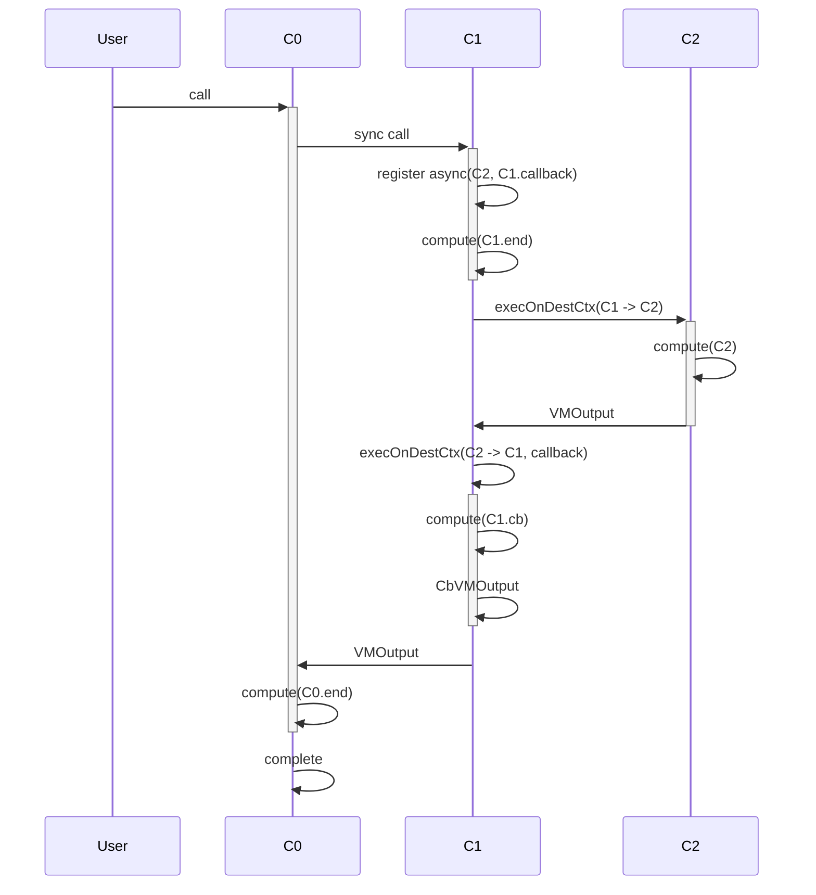
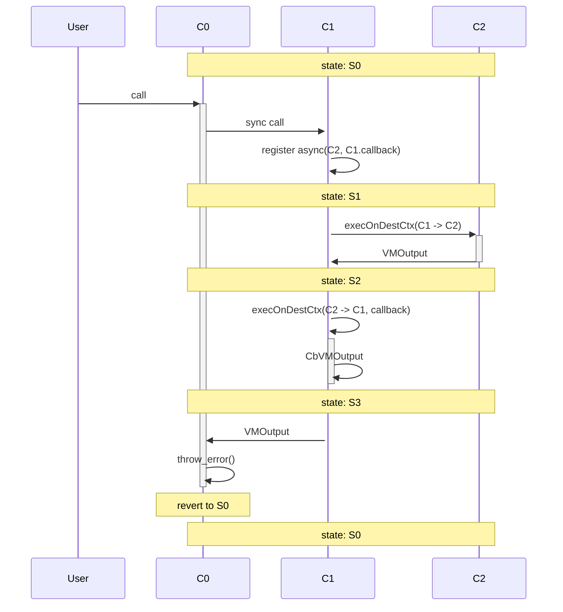

## 1

```rust
shard Sh1 {
  contract C0 {
    fn method0() {
      sync(C1)
      compute("C0.end")
    }
  }
  contract C1 {
    fn endpoint() {
      async(C2, callback)
      compute("C1.end")
    }

    fn callback() {
      compute("C1.cb")
    }
  }

  contract C2 {
    fn method2() {
      compute("C2")
    }
  }
}

```




## 2

`C1` fails after the async call registration: async all is cancelled as in [a(i)#4](a(i).md#4), and everything is reverted.

## 3

`C2` fails: The error is handled as in [a(i)#2](a(i).md#2). After the callback, `C0` continues to execute.

## 3

The callback fails: The error is handled as in [a(i)#3](a(i).md#3). After reverting the callback, `C0` continues to execute.

## 4

The callback fails: The error is handled as in [a(i)#3](a(i).md#3). After reverting the callback, `C0` continues to execute.

## 5

`C0` fails after the sync call: if `C0` fails after executing the async call and the callback locally, everything is reverted to the initial state, including the async call.

