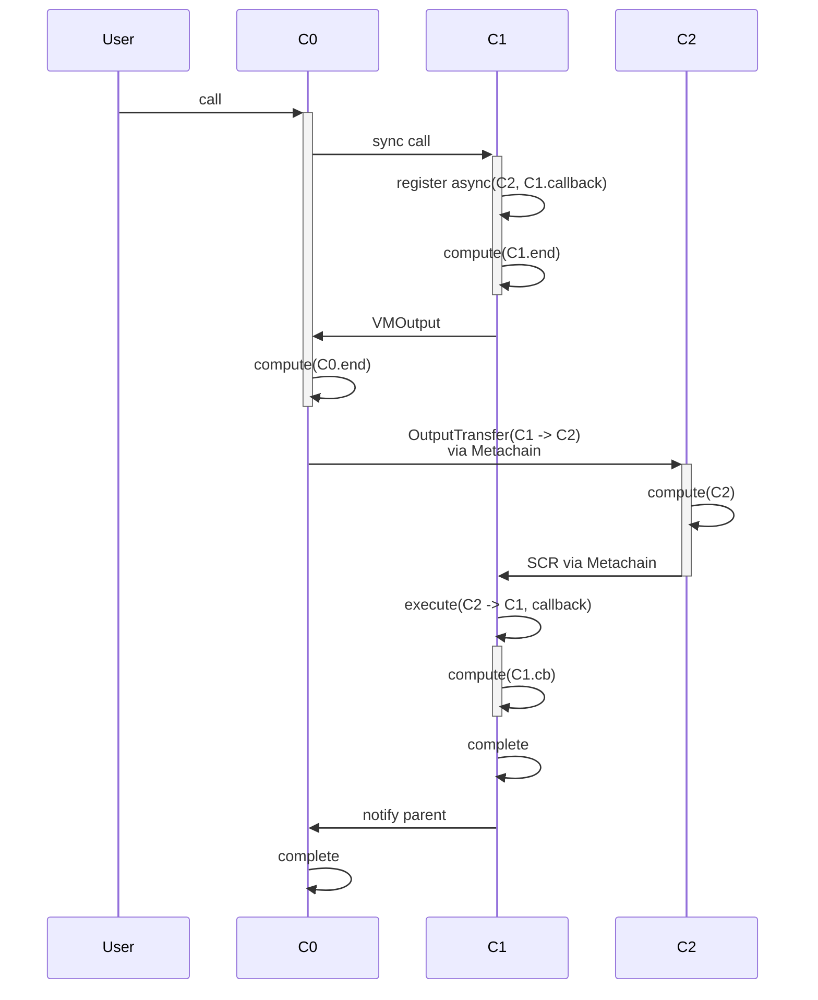

## 1

```rust
shard Sh1 {
  contract C0 {
    fn method0() {
      sync(C1)
      compute("C0.end")
    }
  }
  contract C1 {
    fn method1() {
      async(C2, callback)
      compute("C1.end")
    }

    fn callback() {
      compute("C1.cb")
    }
  }
}

shard Sh2 {
  contract C2 {
    fn method2() {
      compute("C2")
    }
  }
}

```




Output transfers are sent after runtime completion of `C0`

## 2

`C0` or `C1` fails after the async call registration: async all is cancelled, and everything is reverted.

## 3

`C2` or the callback fails: The error is handled as in [a_c#2](a_i.md#2) or [a_c#3](a_i.md#3).
