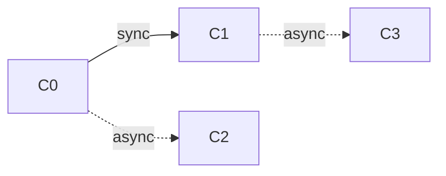

# Async and sync calls in the same contract




```rust
contract C0 {
  fn method0() {
    sync(C1, method1)
    sync(C2, method2, callback)
  }

  fn callback() { }
}

contract C1 {
  fn method1() {
    async(C3, method3, callback)
  }

  fn callback() { }
}

contract C2 {
  fn method2() { }
}

contract C3 {
  fn method3() { }
}
```

In this example, `C0` registers makes a sync call to `C1` and then registers an async call to  `C2`.

## Intra-shard

Since local calls are executed after the runtime completion of the caller, `C3` and `C1.callback` are executed after `C1`'s runtime completion. Then, `C0` registers the async call. Finally, `C2` and `C0.callback` is executed.

## Cross-shard

If `C0` and `C1` are in `Shard1`, and `C2` and `C3` are in `Shard2`; `C2` will be executed before `C3` because the async calls are executed in the registration order.
