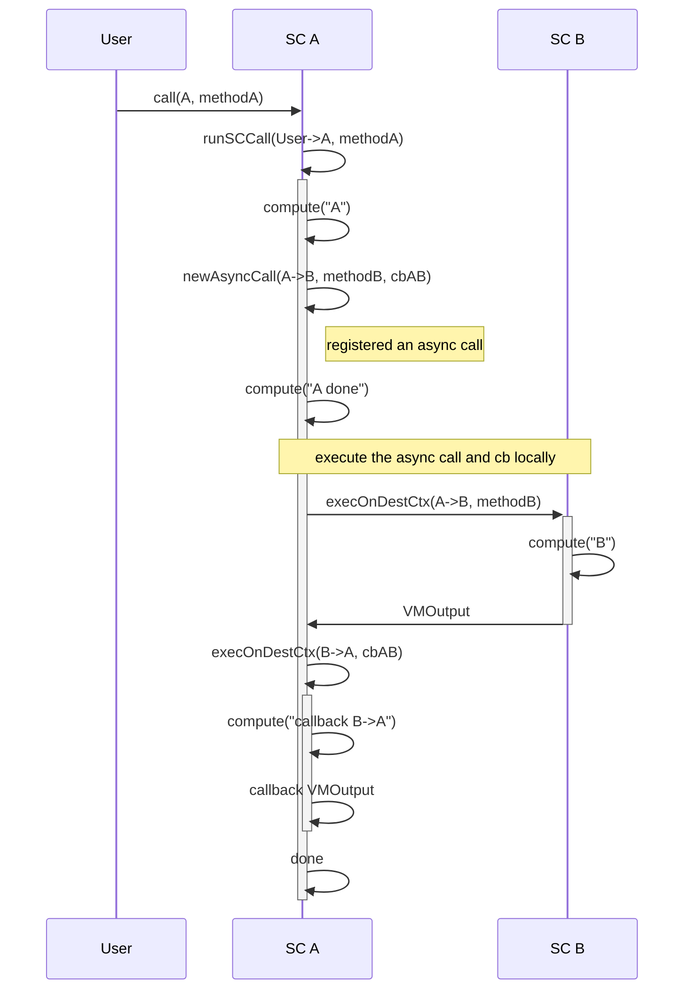
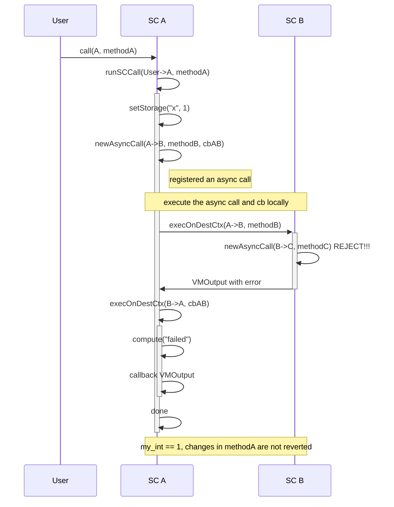
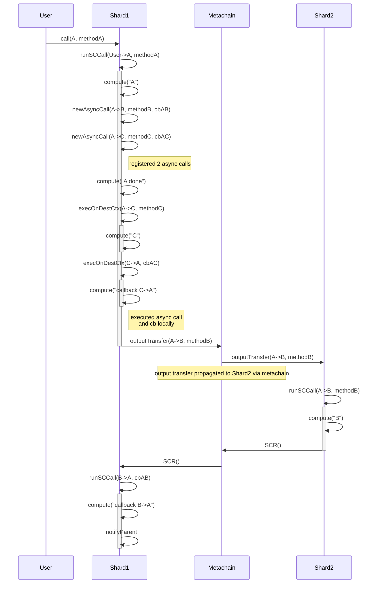

## Intra shard

```rust
shard 1 {
  sc A {
    method methodA {
      compute("A")
      async(B, methodB, cbAB)
      compute("A done")
    }

    callback cbAB { 
      compute("callback B->A")
    }

  }

  sc B {
    method methodB {
      compute("B")
    }
  }
}
```

User calls SC A



## Multi-level Intra shard

```rust
shard 1 {
  sc A {
    method methodA {
      setStorage("my_int", 1)
      async(B, methodB, cbAB)
    }

    callback cbAB(res) { 
      match res {
        Ok => compute("done");
        Err => compute("failed")
    }

  }

  sc B {
    method methodB {
      async(B, methodB)
    }
  }

  sc C {
    method methodB { }
  }
}
```

User calls SC A



## Intra and cross shard

```
shard 1 {
  sc A {
    method methodA {
      compute("A")
      async(B, methodB, cbAB)
      async(C, methodC, cbAC)
      compute("A done")
    }

    callback cbAB { 
      compute("callback B->A")
    }

    callback cbAC { 
      compute("callback C->A")
    }
  }

  sc C {
    method methodC {
      compute("C")
    }
  }
}

shard 2 {
  sc B {
    method methodB {
      compute("B")
    }
  }
}
```

User calls SC A



