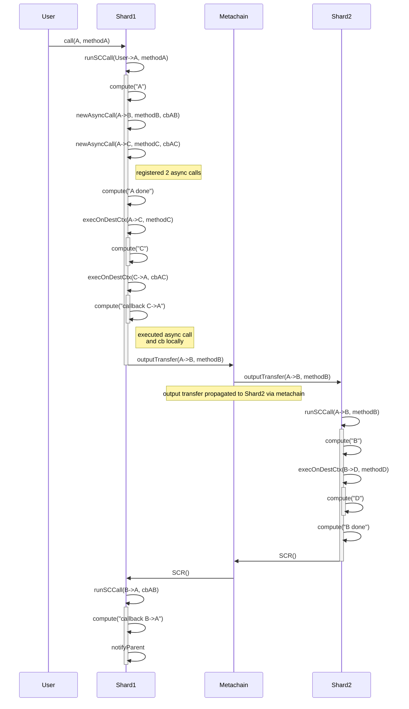
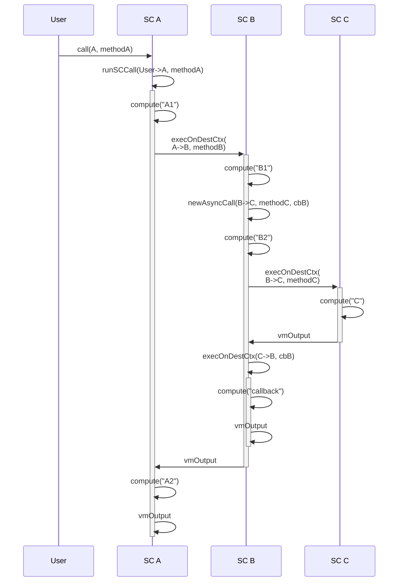

## Case 1

```
shard 1 {
  sc A {
    method methodA {
      compute("A")
      async(B, methodB, cbAB)
      async(C, methodC, cbAC)
      compute("A done")
    }

    callback cbAB { 
      compute("callback B->A")
    }

    callback cbAC { 
      compute("callback C->A")
    }
  }

  sc C {
    method methodC {
      compute("C")
    }
  }
}

shard 2 {
  sc B {
    method methodB {
      compute("B")
      execOnDestCtx(D, methodD)
      compute("B done")
    }
  }
  sc D {
    method methodD {
      compute("D")
    }
  }
  
}
```

User calls SC A




## Case 2

```
shard 1 {
  sc A {
    method methodA {
      compute("A1")
      execOnDestCtx(B, methodB)
      compute("A2")
    }
  }

  sc B {
    method methodB {
      compute("B1")
      async(C, methodC, cbB)
      compute("B2")
    }

    callback cbB {
      compute("callback")
    }
  }

  sc C {
    method methodC {
      compute("C")
    }
  }
  
}
```

```
A1 > B1 > register async > B2 > C > callback > A2
```


