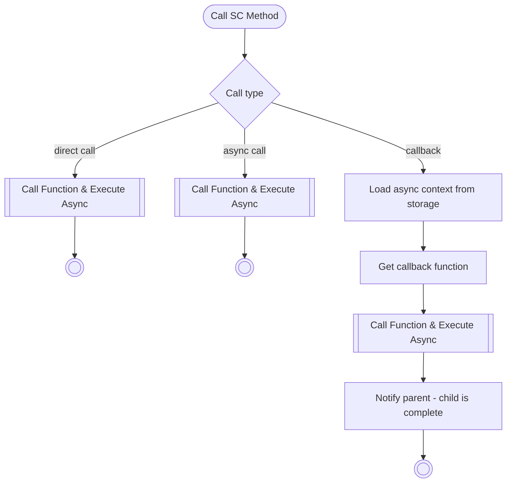
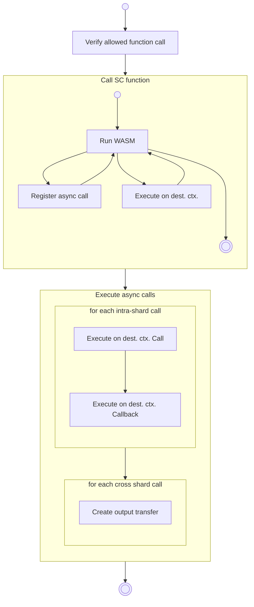
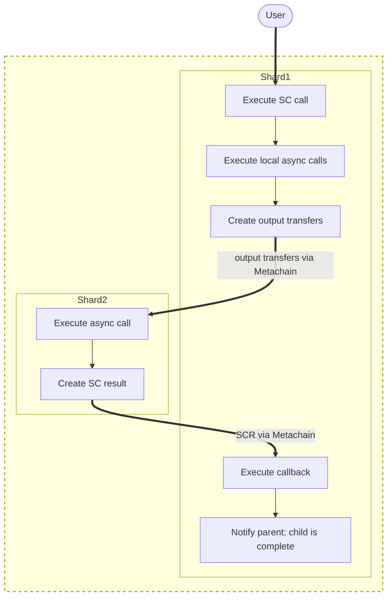

## [Call SC Method](https://github.com/multiversx/mx-chain-vm-go/blob/69e712b5198b297dce715677bcbe27a1c7913c83/vmhost/hostCore/execution.go#L1147)

## [Call Function & Execute Async](https://github.com/multiversx/mx-chain-vm-go/blob/69e712b5198b297dce715677bcbe27a1c7913c83/vmhost/hostCore/execution.go#L1235)

## Cross-shard execution

